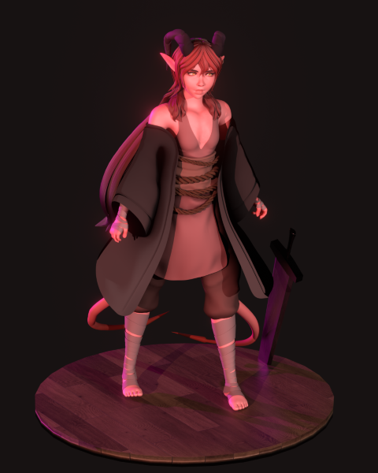
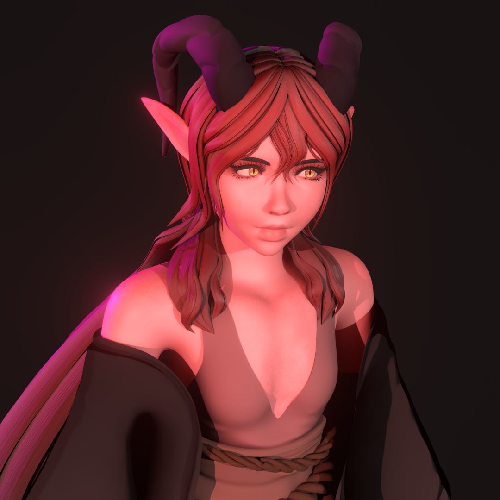

# The Birth of Aisling: A Character Study

Bringing **Aisling**, one of my Dungeons and Dragons Tiefling characters, to life was more than just a spur of the time creative endeavor; it was a crash course in the modern 3D pipeline for me. At the time, I had a small amount of experience in this aspect, so I treated this project as a series of **Agile Sprints**, allowing me to learn, fail fast, and iterate toward a higher quality final render.

---

## The Pipeline Workflow

Since I didn't have a visual concept sketch, I relied heavily on **anatomical references**, other Tiefling character designs and the textual lore from my Dungeons & Dragons campaign to guide the art.

### 1. The Sculpt (Focus 1: Form & Anatomy)
I began with a block-out, focusing on human anatomy before layering on the Tiefling features. 
* **Challenge:** Learning how to sculpt while keeping realistic proportions.
* **Solution:** Used a "Primary to Tertiary" detail workflow, attempting to ensure the silhouette of my character was strong before adding textures (which was a design tip I had gathereed from Riot Games' art video on Youtube).

### 2. Retopology & Clothing (Sprint 2: Optimization)
Moving from a high poly sculpt to a posable/riggable functional model required learning and applying **retopology**. I manually placed loops through manual pooly placement to ensure the mesh would deform correctly for future animation.
* **Pivotting Design based on Capabilities:** Originally, I planned for complex armor to emulate the character's knightly nature, but I pivoted to a more light design to better suit the character's backstory as an initial rogue.

### 3. Texturing & Compositing (Sprint 3: The Final Polish)
Using Blender's node editor and the application UcuPaint, I developed PBR (Physically Based Rendering) textures.
* **The Look:** I focused on more stylized and "round" textures, avoid hyper realism as I wasn't yet proficient with that style.
* **Final Touch:** The project was finished in **Blender's Compositor**, where I adjusted color grading and lighting to evoke the mood of a dark fantasy setting.

---

## Lessons Learned

Being "new to the process" meant the learning curve was vertical. However, by breaking the daunting task into **iterative milestones**, I managed to:
* Further Master the Blender UI and hotkeys.
* Understand the relationship between topology and light.
* Translate abstract character traits into visual storytelling elements.

> **Project Reflection:** "The hardest part wasn't the navigating Blender; it ended up being the discipline of staying within my own allotted goals without getting lost in the 'infinite detail' trap of sculpting."

# The Birth of Aisling: A Character Study

Bringing **Aisling**, one of my Dungeons and Dragons Tiefling characters, to life was more than just a spur of the time creative endeavor; it was a crash course in the modern 3D pipeline for me. At the time, I had a small amount of experience in this aspect, so I treated this project as a series of **Agile Sprints**, allowing me to learn, fail fast, and iterate toward a higher quality final render.

---

## The Pipeline Workflow

Since I didn't have a visual concept sketch, I relied heavily on **anatomical references**, other Tiefling character designs and the textual lore from my Dungeons & Dragons campaign to guide the art.

### 1. The Sculpt (Focus 1: Form & Anatomy)
I began with a block-out, focusing on human anatomy before layering on the Tiefling features. 
* **Challenge:** Learning how to sculpt while keeping realistic proportions.
* **Solution:** Used a "Primary to Tertiary" detail workflow, attempting to ensure the silhouette of my character was strong before adding textures (which was a design tip I had gathereed from Riot Games' art video on Youtube).

### 2. Retopology & Clothing (Sprint 2: Optimization)
Moving from a high poly sculpt to a posable/riggable functional model required learning and applying **retopology**. I manually placed loops through manual pooly placement to ensure the mesh would deform correctly for future animation.
* **Pivotting Design based on Capabilities:** Originally, I planned for complex armor to emulate the character's knightly nature, but I pivoted to a more light design to better suit the character's backstory as an initial rogue.

### 3. Texturing & Compositing (Sprint 3: The Final Polish)
Using Blender's node editor and the application UcuPaint, I developed PBR (Physically Based Rendering) textures.
* **The Look:** I focused on more stylized and "round" textures, avoid hyper realism as I wasn't yet proficient with that style.
* **Final Touch:** The project was finished in **Blender's Compositor**, where I adjusted color grading and lighting to evoke the mood of a dark fantasy setting.

---

## Lessons Learned

Being "new to the process" meant the learning curve was vertical. However, by breaking the daunting task into **iterative milestones**, I managed to:
* Further Master the Blender UI and hotkeys.
* Understand the relationship between topology and light.
* Translate abstract character traits into visual storytelling elements.

> **Project Reflection:** "The hardest part wasn't the navigating Blender; it ended up being the discipline of staying within my own allotted goals without getting lost in the 'infinite detail' trap of sculpting."