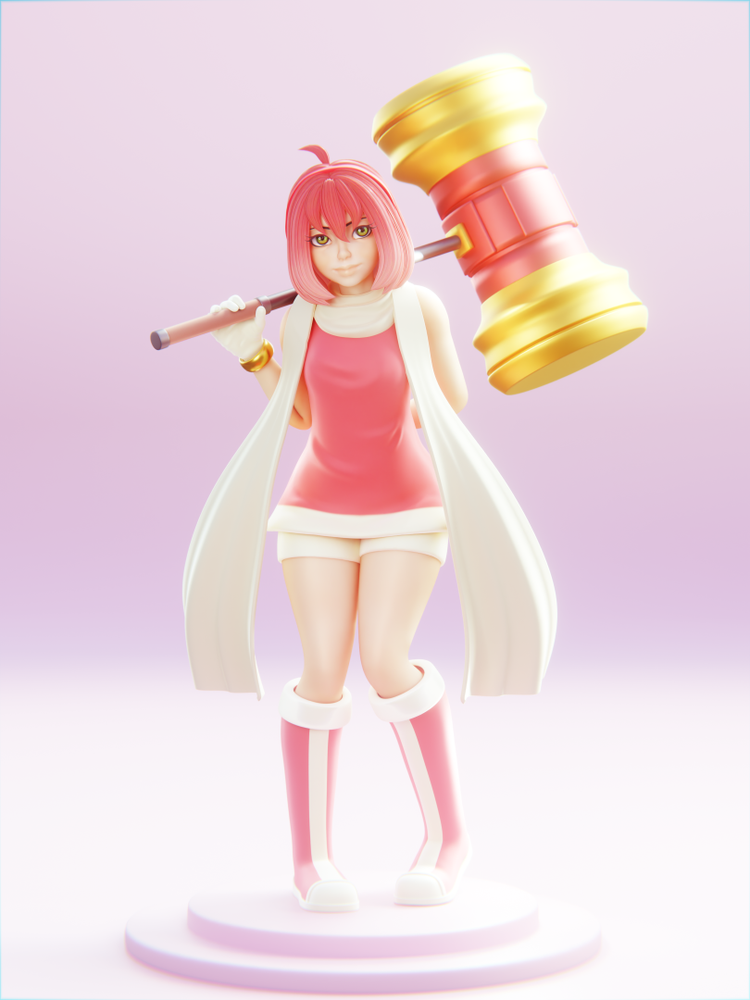
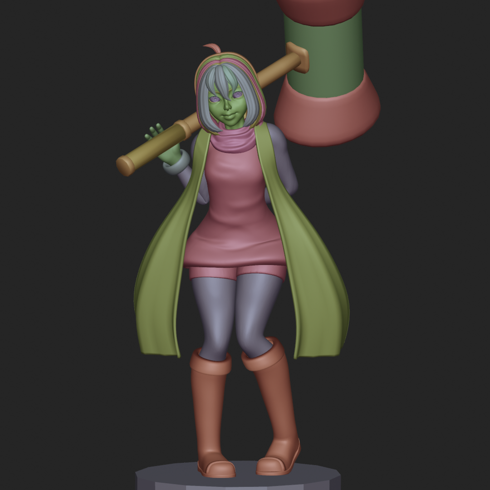

# Evolution in Form: Amy the Hedgehog

A year into creating Blender artwork, I wanted to experiment as much as I could in character design by creating a custom humanoid "Amy" concept into the third dimension. This project wasn't just about sculpting a likeness; it was an experiment in vertex colour painting/texturing and eventually photographic lighting techniques in Blender.

---

## Design and Sculpting

Like a good deal of my previous works, this model was born from my natural interest into different properties, and in this case it was Sonic. 

* **The Goal:** To blend the recognizable silhouettes with a more grounded, humanoid anatomy.
* **The Process:** Sculpted entirely in Blender, I focused on clean, flowing surfaces and grooves to make things feel "stylized yet solid,".

---

## Lighting as Architecture

The standout feature of this render is the lighting. Rather than using standard point or area lights, I experimented with **Planar Lighting**.

* **The Setup:** I added and curved planes within the scene and applied strong **Emission Shaders** to them. 
* **The Effect:** I had hoped to emulate professional softboxes used in real world portrait photography; which paired nicely with the cyclorama I set up behind the model. By shaping the "light-geometry," soft fall off and rim lighting ended up giving the character a rounded feel.

---

## Vertex Painting vs. Texturing

In an attempt to move away from the standard PBR workflow, this model had featured **zero external/baked textures**. 

* **Vertex Color:** Every hue and shade was painted directly onto the geometry's vertices within Blender, with fresnels and gradients accompanying where necessary. 
* **Why this choice?** Vertex painting allowed me to focus purely on the "form and color" relationship without worrying about UV unwrapping or retopologising. It creates a seamless, figure-like aesthetic that complements the stylized design.

---

## Post-Processing and Finishing

Blender's Cycles engine ended up doing a lot of the heavy lifting here as well, with the final polish being added through Blender's compositor Cycle Nodes.

* **Color Grading:** Pushed the warmer tones to emphasize Amy's signature palette.
* **Refinement:** Filters and Anti liasing were added to ensure the render popped for general viewing.

---

## One Year Later: Reflection

Comparing this to my early work, the difference is in the intentionality. I had grown confident; using tools like emission geometry and vertex painting to make specific stylistic choices.

> **Key Takeaway:** "Lighting isn't just about making things visible; it's about holding and highlighting the shape of the character as much as the sculpt itself."