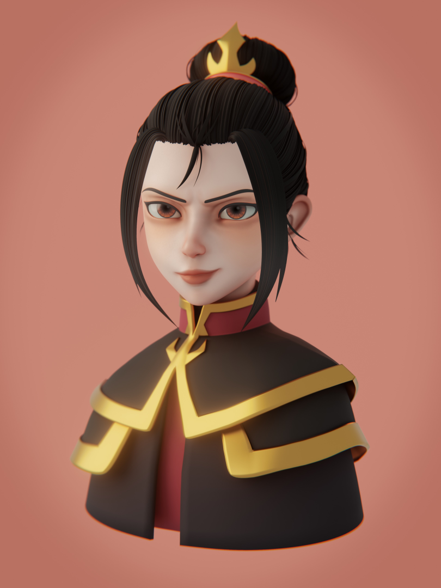
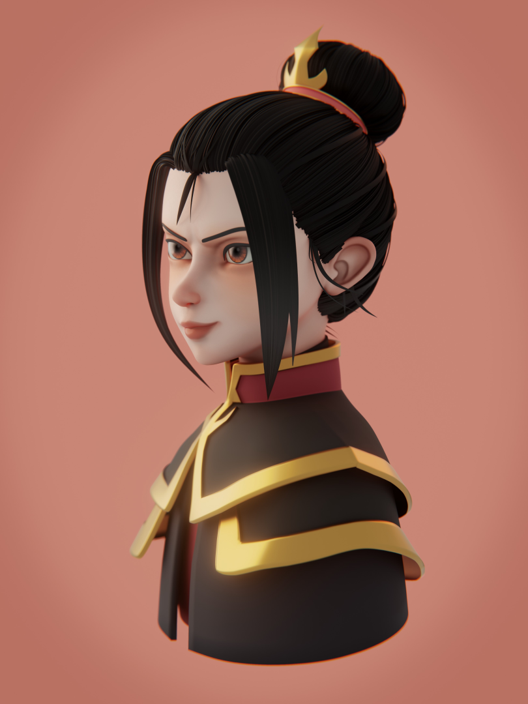
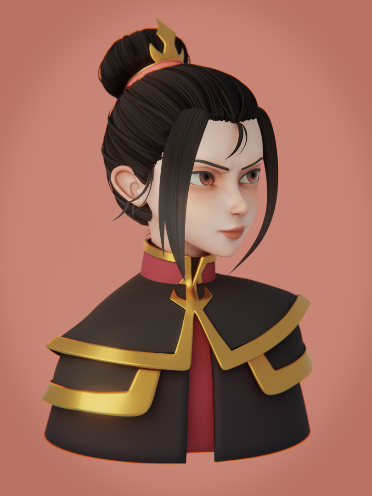
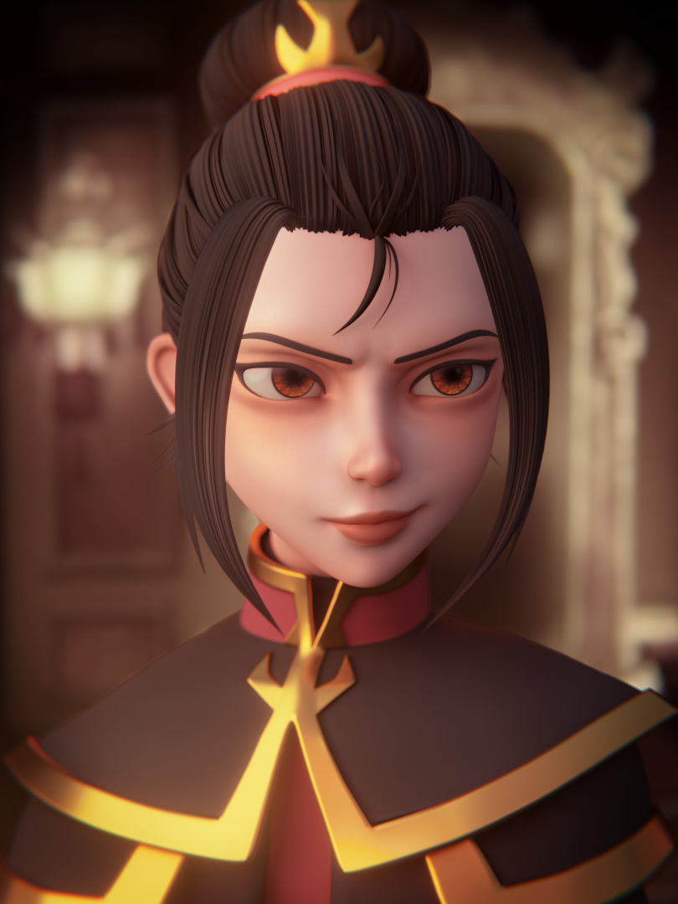

---

Blender Sculpt of Azula from Avatar the Last Airbender. This project was a fanart piece that took me a week and 3 days to complete. The artwork was created from a 2D character concept to a final render. The project was completed using Blender for modeling and rendering, with final touch-ups done in Blender's compositor.

