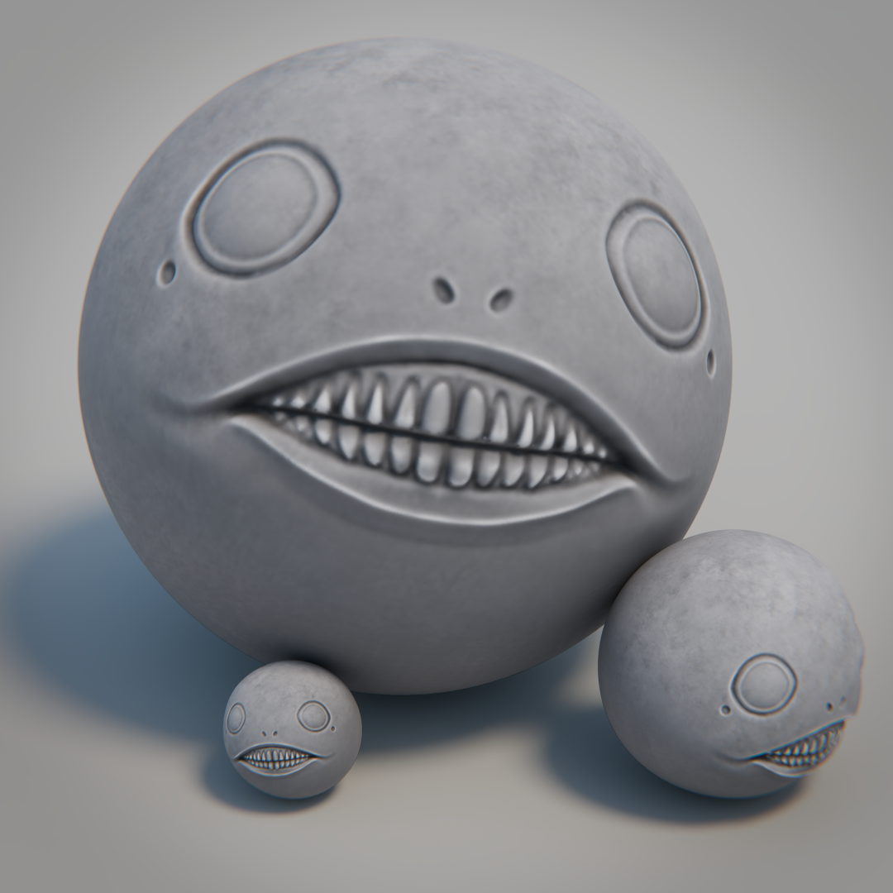

Emil's head from the Nier series, a quick 2 hour long exploration of 3d prop creation. This is a modelled artwork, from 2d charactetr concept to texturing to final render. The project was completed using Blender for modeling and rendering, with final touch-ups done in Blender's compositor.

