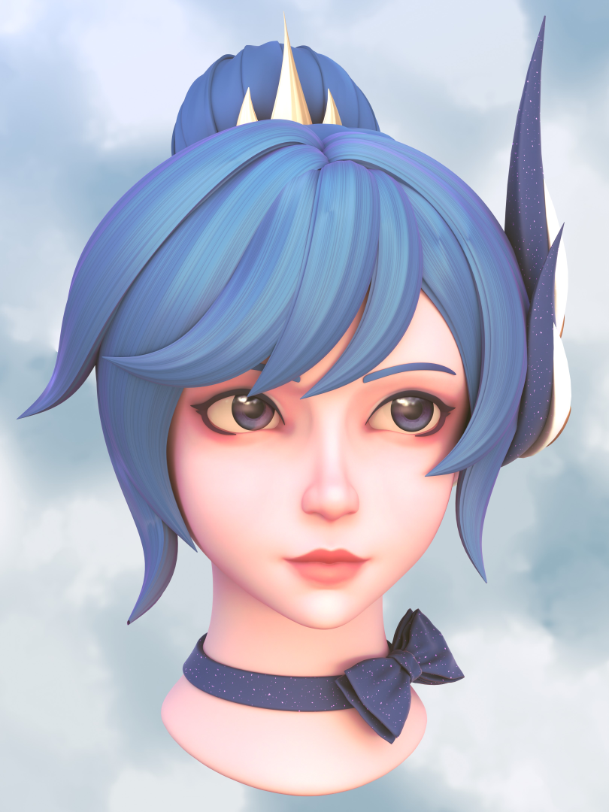
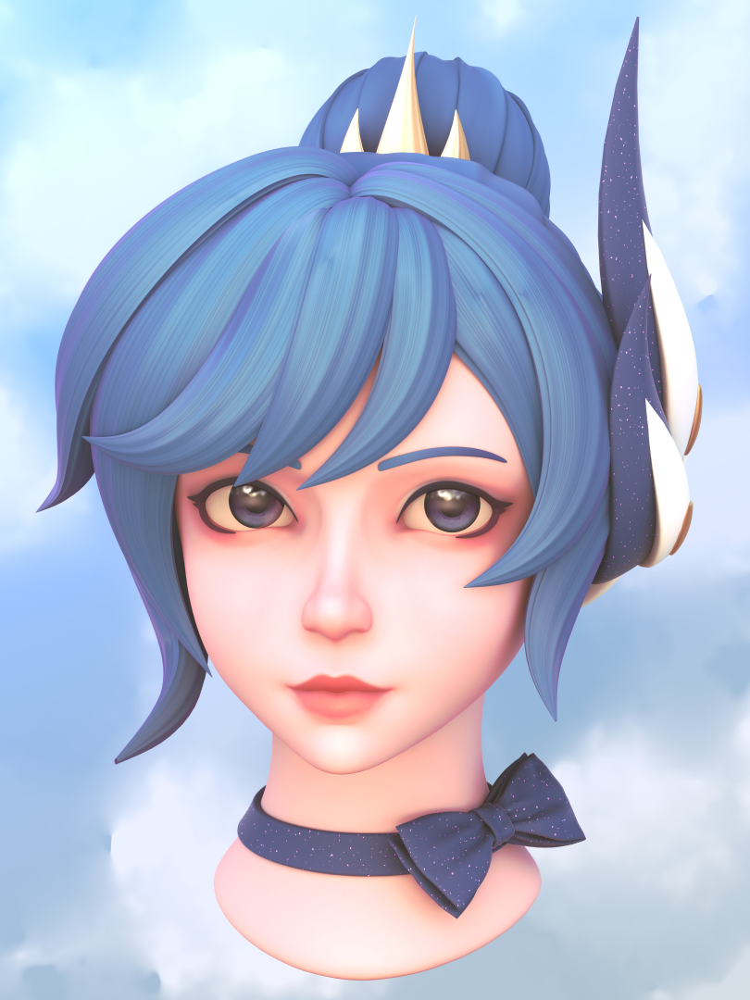
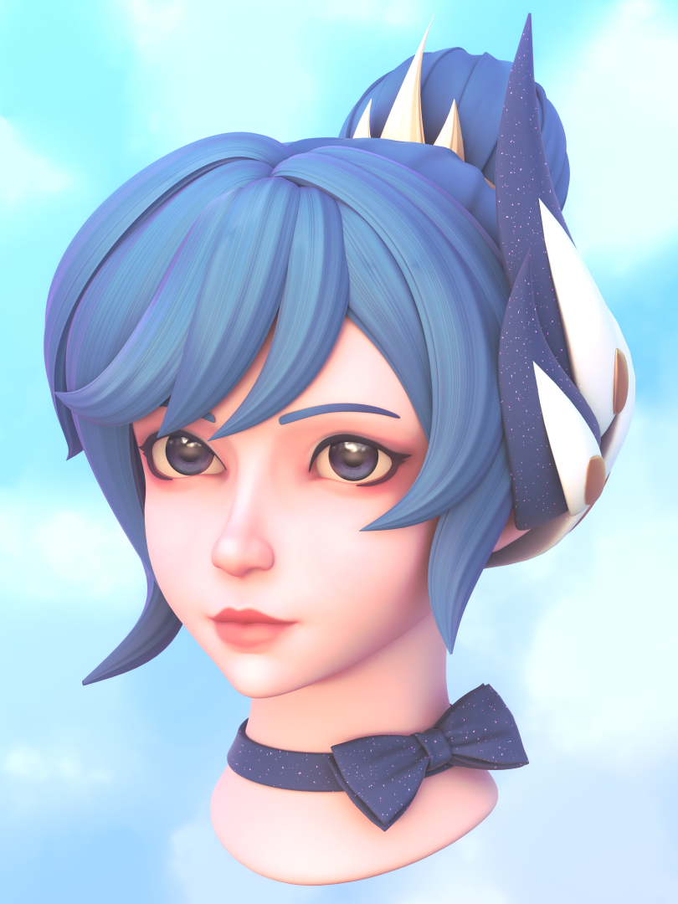

A technical exploration into hand-painted aesthetics and stylized lighting. 
  This project focuses on using Fresnel-driven color gradients and Kuwahara 
  filtering to achieve a signature League of Legends-inspired look.

This project served as an early deep dive into a stylized character workflow (made popular at the time through Riot Games' smash hit show Arcane), focusing on hand-painted textures in conjunction with procedural materials to define the character's styling. 
I experimented heavily with Fresnel driven color gradients to give the skin surfaces a dynamic, natural shift in glow that reacts to the viewing angle, ensuring the volumes felt consistent with the artistic Riot aesthetic.
To tie things together, I used a light Kuwahara filter in the Blender compositor, which applied a subtle painterly softening to the edges and helped bridge the gap between a 3D sculpt and a 2D concept illustration a bit.