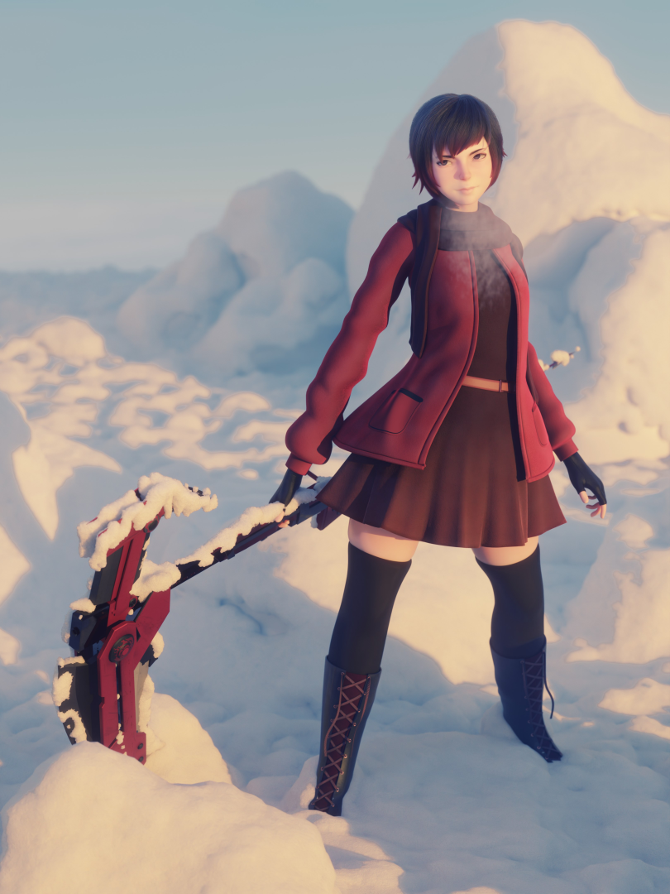
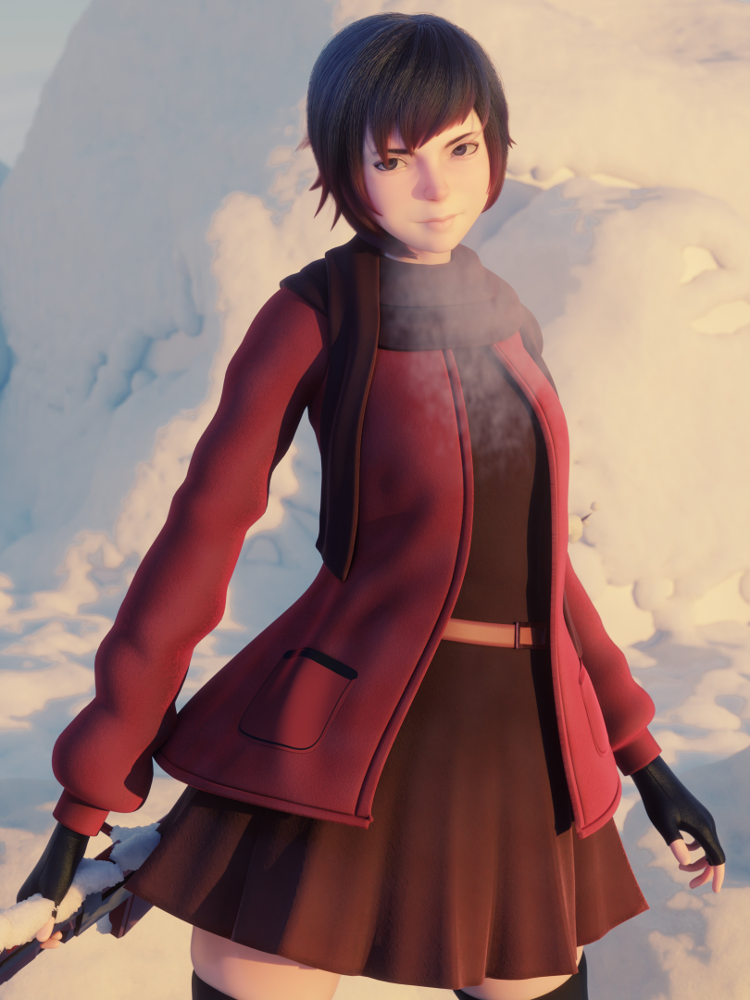
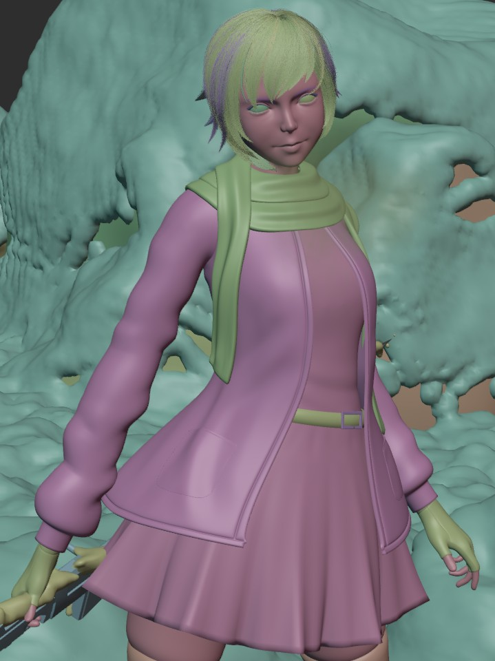
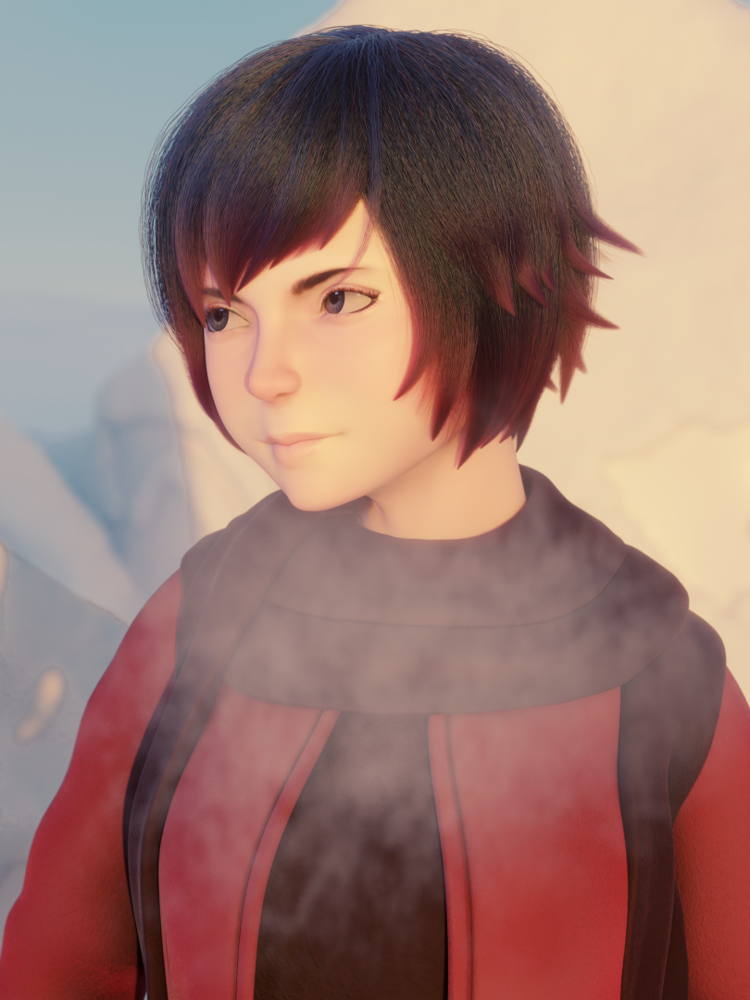
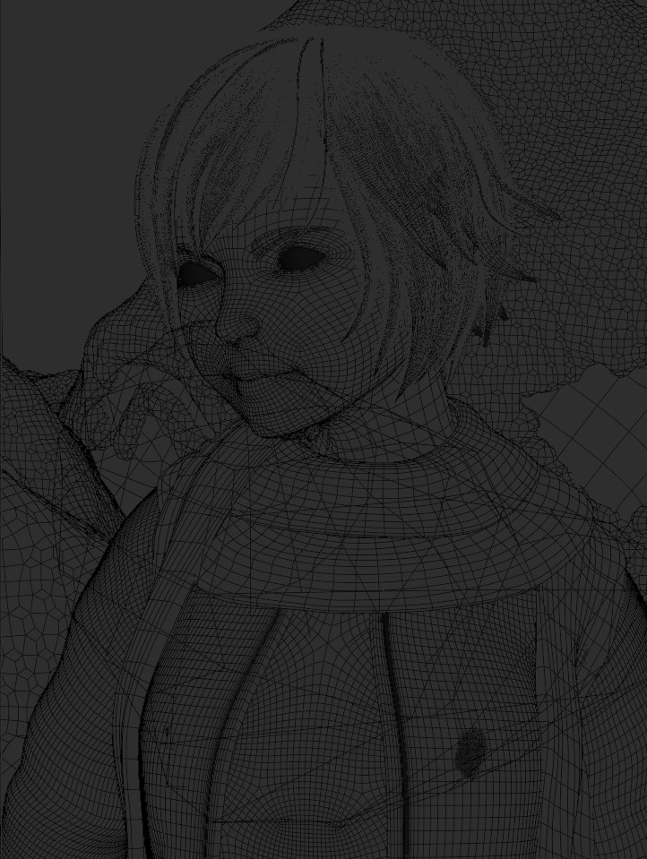

A RWBY fanart project that took me a week and 3 days to complete. This is a sculpt artwork, from 2d charactetr concept to final render. The project was completed using Blender for modeling and rendering, with final touch-ups done in Gimp/Krita.

